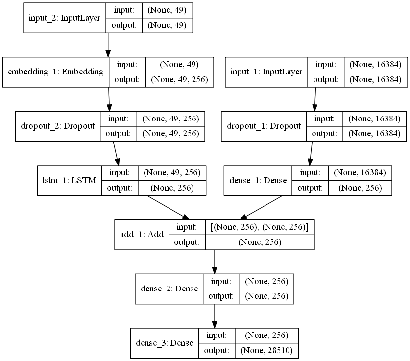
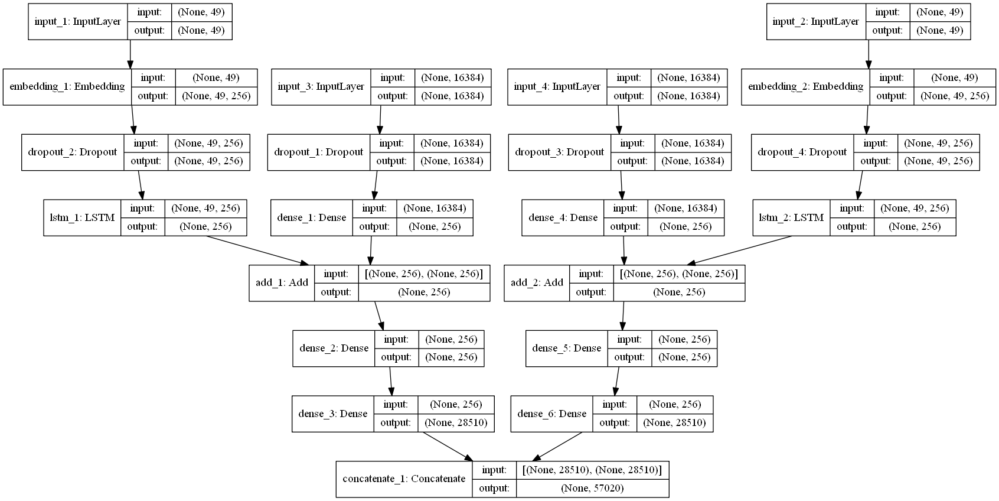

# Image Caption Generator
Generate image captions using an encoder-decoder model. 

# Implementation Details
The code is written in Python and uses the Keras and Tensorflow frameworks for deep learning architectures. It used the MS COCO dataset which contains more than 200K images with 5 captions each, and around 120K unlabelled images. Using this data, positive and negative image-caption pairs are created. Positive pairs consist of images with their correct captions and negative pairs consist of images with incorrect captions. Using the contrastive loss function helps the model generate captions that are as close as possible to the positive pairs and as far as possible from the negative pairs. 

## Data Preparation
The relevant data consists of images and their natural language captions. Image data was resized to 224x224. The captions were used to build the vocabulary of the model. Below are the steps to create the vocabulary: 
- Clean the data:
	-	Change all characters to lowercase. 
	-	Discard all words that contain numbers or symbols. 
	-	Remove all punctuation. 
	-	Drop all words less than 3 characters long. 
- Add `startseq` and `endseq` on either side of the captions. 
- Add all remaining words to a file to create the vocabulary. 
- Map all captions to their image ID to create the positive pairs. 
- Create mappings between images and random captions to create the negative pairs. 
- Use the tokenizer to transform the characters to integer representations. 
- Use an LSTM unit to create word embeddings using the integer representations. 

## CNN Encoder
A convolutional neural network is used to create image feature vectors for each image in the dataset. The CNN architecture used is the 22-layer GoogLeNet architecture. The final fully connected layer is taken off and the output at that step is used as the image feature vector. The GoogLeNet architecture was implemented from scratch with a few changes to the inception layers. 

## LSTM Decoder
The decoder LSTM unit receives information about the image and the caption. This information is processed and the output is passed through two dense layers whose final output is equal to the size of the vocabulary. The initial input to the LSTM is the startseq and successive inputs consist of the word embeddings for each prediction. 

## Contrastive Loss 
The above encoder-decoder setup is created twice - once for the positive pairs and once for the negative pairs. Each of these models forms one arm of the final model. Their outputs are merged and sent to the final `Dense` layer with softmax activation. The contrastive loss function itself is a custom loss function which uses the following formula:

L(\phi,\theta;X,Y) = \sum_{t=1}^{T_{m}} ln[h((c_{t},I_{t});\theta,\phi)] + \sum_{t=1}^{T_{n}} ln[1 - h((c_{t}|I_{t});\theta,\phi)]

where the first summation term is the loss of the positive pairs and the second summation term is for the negative pairs. The learning process encourages distinctiveness of captions by supressing negative pairs and maintains the overall accuracy of the model by maximizing the probability of the positive pairs. Therefore the contrastive loss function learns two constraints over the baseline. The model was trained using the ADAM optimizer with AMSGrad to prevent the loss from diverging to NaN. 

# Results and Notes
The model was trained using AWS EC2 instances. None of the captions generated were grammatically correct, however most of them recognized relevant objects in the image. Some of the captions were gibberish and did not contain any relevant objects. 